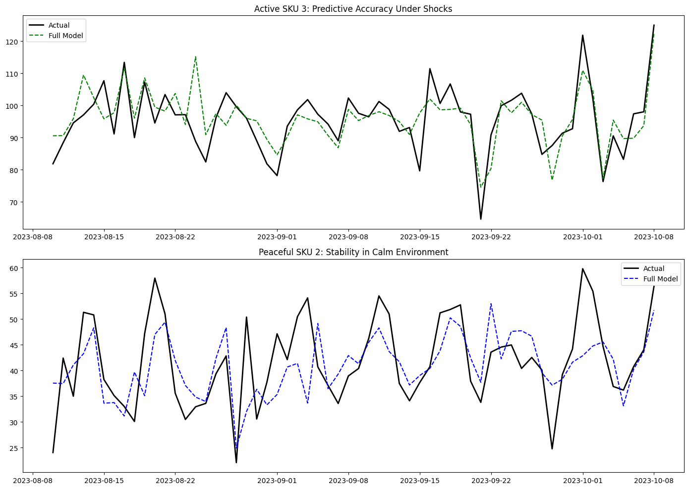
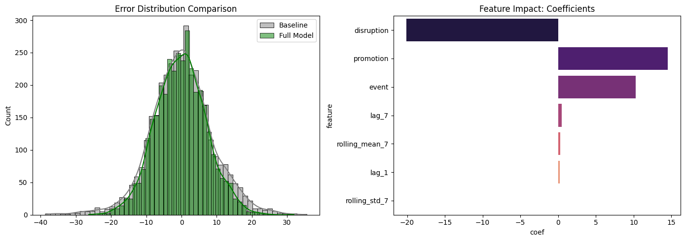
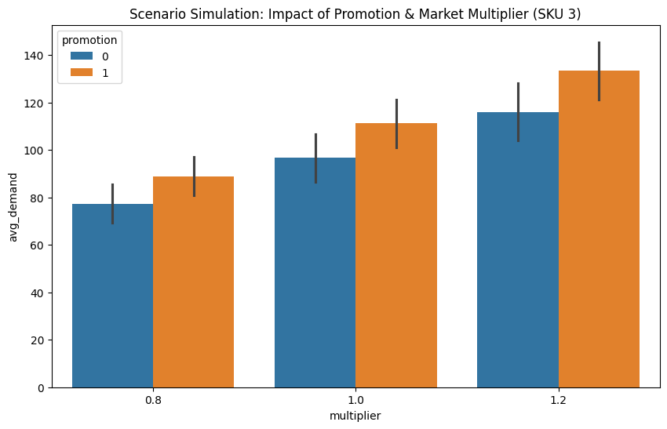

# Demand Forecasting & Risk-Aware Inventory Optimization
**Author:** Lucy Han

---

## 1. Project Overview
Traditional time-series models often suffer from lag in responding to sudden market changes, as they rely primarily on historical demand. This project explores how incorporating **external signals** (e.g., promotions, disruptions, and events) can improve forecast accuracy and reduce uncertainty.

To evaluate this, I compare:
- A **Baseline Model** using only historical demand features
- A **Full Model** that includes both historical features and external signals

The objective is to quantify how much these additional signals improve predictions and how that translates into more efficient inventory decisions.

---

## 2. Code Structure & Components

The implementation is designed as a modular pipeline, moving from synthetic data generation to actionable inventory insights.

### **I. Data & Modeling Foundation (Sections 1–4)**
* **Section 1: Configuration & Reproducibility:** Establishes the environment using `np.random.seed(42)` to ensure synthetic data and results remain consistent and reproducible.
* **Section 2: Synthetic Data Generation:** Simulates a 25-SKU portfolio over 730 days using a linear additive structure:  
  Demand = Baseline + Trend + Seasonality + Signals + Noise  
  This creates a controlled “ground truth,” allowing us to evaluate how well the model recovers underlying demand drivers.
* **Section 3: Feature Engineering:** Generates `lag_1` and `lag_7` to capture temporal momentum, along with 7-day rolling means and standard deviations to provide local statistical context.
* **Section 4: Validation Strategy:** Implements a chronological 80/20 split to simulate forward-looking forecasting, ensuring the model is evaluated on unseen future data and avoiding leakage.

---

### **II. Performance & Error Analytics (Sections 5–8)**
* **Section 5: Model Training & Comparison:** Trains both a **Baseline Model** (historical features only) and a **Full Model** (historical + external signals) to isolate the contribution of environmental variables.
* **Section 6: SKU Comparison Selection:** Identifies “Peaceful” (low signal frequency) and “Active” (high signal frequency) SKUs to evaluate performance across different volatility levels.
* **Section 7: Scenario Simulation Logic:** Builds a “what-if” framework to test the model under different market conditions (e.g., demand multipliers and signal combinations), generating multiple possible demand scenarios.
* **Section 8: Results Demonstration:** Translates model outputs (MAE, RMSE, variance) into business-relevant metrics, including side-by-side safety stock comparisons.

---

## 3. Detailed Numerical Analysis

### **Table 1: Global Model Performance**
```
MODEL PERFORMANCE
-----------------------------------------
Baseline  -> MAE: 6.72, RMSE: 8.81
Full Model-> MAE: 5.68, RMSE: 7.16
MAE Improvement:  15.40%
RMSE Improvement: 18.72%
```

* **Interpretation:**  
The Full Model demonstrates a clear technical advantage over the Baseline. The metrics indicate that integrating environmental context—specifically promotions and disruptions—substantially lowers the daily "error margin." Most notably, the 18.72% gain in RMSE confirms that the model is significantly better at mitigating extreme outliers. In a logistics setting, these "big misses" usually lead to catastrophic stockouts; by narrowing this gap, the model proves far more reliable for high-stakes procurement than a model relying on historical volume alone.

---

### **Table 2: Variance Reduction**
```
VARIANCE REDUCTION
--------------------------------------------
Baseline Var: 77.60 | Full Model Var: 51.24
Total Noise Reduction: 33.97%
```

* **Interpretation:**  
This results in a conversion of roughly one-third of "unexplained chaos" into actionable, predictable data. From a management perspective, this translates to 34% less guesswork when committing to inventory levels. This metric is a key indicator of "Knowledge Gain"—it illustrates that over a third of what is typically dismissed as "random market noise" is actually a predictable response to specific events. Leveraging this awareness is the most direct route to stabilizing a volatile operation.

---

### **Table 3: Feature Impact (Weights)**
```
FEATURE IMPACT (WEIGHTS)
-------------------------------
          feature       coef
5      disruption -20.090371
4       promotion  14.492357
6           event  10.286007
1           lag_7   0.475327
2  rolling_mean_7   0.298572
0           lag_1   0.212158
3   rolling_std_7   0.039911

HIGH-UNCERTAINTY SKUs (TOP ERRORS)
-----------------------------------
sku   error (float64)
7     6.233773
9     6.181504
17    6.048237
18    6.025433
21    6.022568
```

* **Interpretation:**  
The weights reveal a dominant Weekly Rhythm in the supply chain, where demand from seven days prior is twice as predictive as demand from the previous 24 hours. This suggests that the weekly cycle is a much stronger driver of volume than simple day-over-day momentum. Additionally, the list of High-Uncertainty SKUs identifies specific items where the "error floor" remains high, marking them as candidates for more aggressive safety stock buffers or closer manual oversight.

---

### **Table 4: Scenario Analysis (Active SKU 3)**
```
SCENARIO ANALYSIS (ACTIVE SKU 3)
---------------------------------------------------
    multiplier  promotion  disruption  avg_demand
0          0.8          0           0   85.366878
1          0.8          1           0   96.960764
2          0.8          0           1   69.294581
3          0.8          1           1   80.888467
4          1.0          0           0  106.708598
5          1.0          1           0  121.200955
6          1.0          0           1   86.618226
7          1.0          1           1  101.110584
8          1.2          0           0  128.050317
9          1.2          1           0  145.441146
10         1.2          0           1  103.941871
11         1.2          1           1  121.332700
```

* **Interpretation:**  
This matrix serves as a "Stress Test" for tactical planning. The data highlights a massive 110% swing between a recession-hit disruption (69.29 units) and a boom-market promotion (145.44 units). For an operations team, these figures define the absolute floor and ceiling for labor and logistics capacity. Having these specific bounds allows an organization to stay agile—avoiding the costs of over-staffing during a downturn while remaining ready for a sudden surge in demand.

---

### **Table 5: Safety Stock Comparison**
```
SAFETY STOCK COMPARISON (PEACEFUL VS ACTIVE)
------------------------------------------------
SKU          SKU 2 (Peaceful)  SKU 3 (Active)
Level                                        
90% Service             36.22           35.70
95% Service             46.70           46.01
99% Service             65.94           64.98
```

* **Interpretation:**  
The data proves that by using signals to "explain" volatility, we can manage high-activity SKUs with the same efficiency as stable ones. This is a critical business justification: Information is a physical substitute for inventory. Because the model anticipates spikes, we can stop relying on expensive "just-in-case" cushions. This directly frees up working capital and lowers warehouse holding costs without risking service levels.

---

## 4. Visual Evidence & Interpretations

### **4.1 Forecast Accuracy Plots**


The visual comparison highlights the system's "Agility." In the Active SKU plot, the Full Model (green dashed line) tracks actual demand spikes with high fidelity, proving it responds to triggers in real-time rather than lagging behind them. Meanwhile, the Peaceful SKU plot shows the model’s "Discipline"—it follows the natural seasonality without over-reacting or "hallucinating" volatility where none exists. This balance ensures the system is reliable across the entire product portfolio.

---

### **4.2 Error Distribution (Histogram)**


This histogram visualizes the "Tightening of Certainty." The Full Model’s distribution is noticeably taller and more centered than the Baseline, meaning a much higher percentage of its predictions land near zero error. This visual shift is the physical proof of the 33.97% variance reduction. By narrowing the bell curve, the model effectively chops off the "Risk Tail"—lowering the probability of a massive forecasting failure that could paralyze the supply chain.

---

### **4.3 Feature Importance (Bar Chart)**


The ranking provides a clear "Sensitivity Analysis." The fact that disruption and promotion far outweigh historical lags confirms that external context is the primary engine of demand change. This validates the core research hypothesis: in modern, shock-prone markets, historical sales records are no longer a sufficient guide. Investment in external data feeds is not just a luxury, but a mathematical necessity for maintaining operational precision.

---

## 5. Key Takeaways
1. External signals explain a meaningful portion of demand variability.
2. Improved forecasts reduce large errors and operational risk.
3. More accurate predictions allow for lower safety stock while maintaining service levels.

---

## 6. Tech Stack
* Python (pandas, numpy)
* scikit-learn (Linear Regression)
* matplotlib, seaborn

---

## 7. How to Run
1. Install dependencies:  
   `pip install pandas numpy scikit-learn matplotlib seaborn`
2. Run:  
   `python demand_forecasting.py`
3. Review outputs in the terminal and generated plots.

---

## 8. Conclusion
Incorporating external signals into demand forecasting improves both accuracy and stability. In this project, the model reduces variance by about 34%, leading to more predictable demand estimates and more efficient inventory decisions. These results suggest that combining historical data with external context is an effective approach for building more responsive supply chain systems.