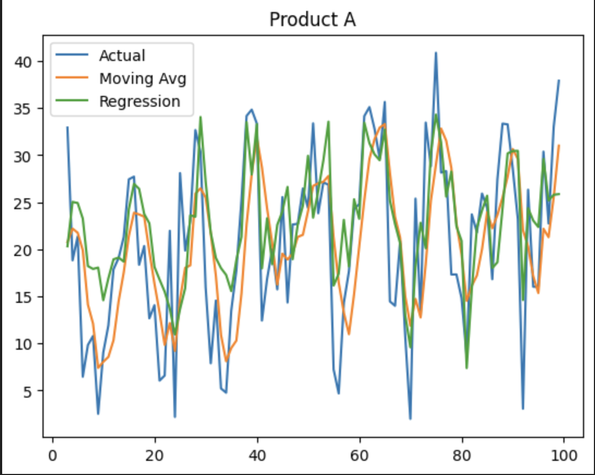

# Demand Forecasting with External Signals & Inventory Insights

This project explores how demand forecasting can support inventory decision-making under uncertainty, with a focus on how external factors influence demand variability.

## Overview
Traditional demand forecasting often relies only on historical sales data. In this project, I extend this approach by incorporating simulated external signals (exogenous features) such as supply disruptions and event-driven demand shifts.

The goal is not only to improve prediction, but to better understand **when and why forecasts become unreliable**, and how that impacts downstream inventory decisions.

## Key Components

### 1. Data Simulation
- Generated synthetic demand data with:
 - Trend
 - Seasonality
 - Random noise
- Simulated multiple products with different demand variability levels
- Introduced external signals:
 - Supply shocks (e.g., production disruptions)
 - Event-driven demand spikes
 - Cost fluctuations

> Note: External signals are simulated for exploratory analysis and do not represent real-world datasets.

---

### 2. Forecasting Models
- Baseline: Moving Average
- Linear Regression with:
 - Lag features (lag_1, lag_2)
 - External signals (supply shock, events, cost)

---

### 3. Error & Uncertainty Analysis
- Compared model performance across products
- Identified high-uncertainty products based on forecast error patterns
- Analyzed how external events impact forecast reliability

---

### 4. Inventory Insights
- Used forecast error as a proxy for demand uncertainty
- Explored how uncertainty may affect:
 - Safety stock decisions
 - Risk of stockouts vs overstock

---

## Key Takeaways

- Forecast accuracy alone is not sufficient for decision-making 
- Demand uncertainty is often driven by external factors, not just randomness 
- Understanding error patterns is critical for inventory planning 

---

## Tech Stack
- Python (Pandas, NumPy, Scikit-learn, Matplotlib)

---

## Example Output
<p align="center">
  
</p>

---

## How to Run

```bash
pip install -r requirements.txt
Open and run:
notebooks/demand_forecasting_analysis.ipynb

Project Scope
This project is a simplified prototype for learning purposes.
 It focuses on analytical insights rather than production-level system design.

Author
Lucy Han

---
